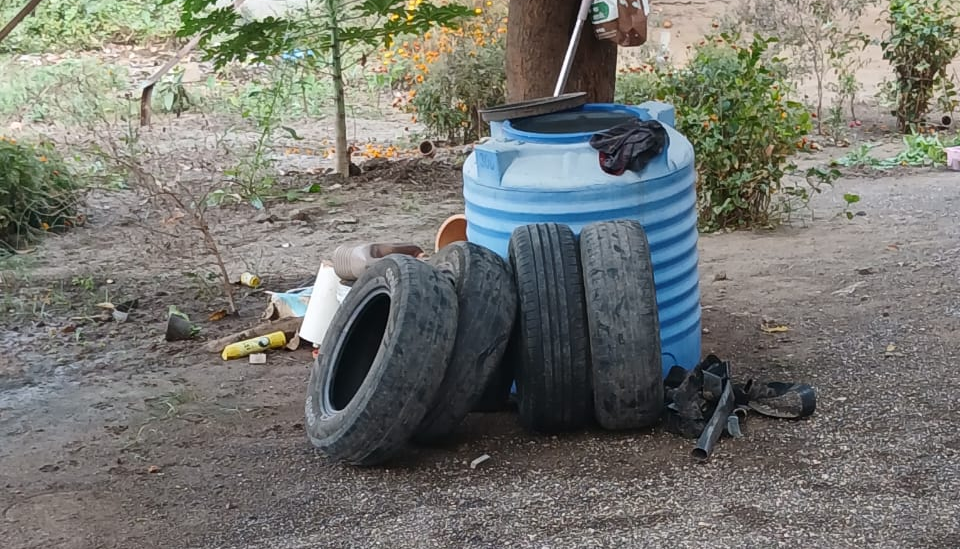
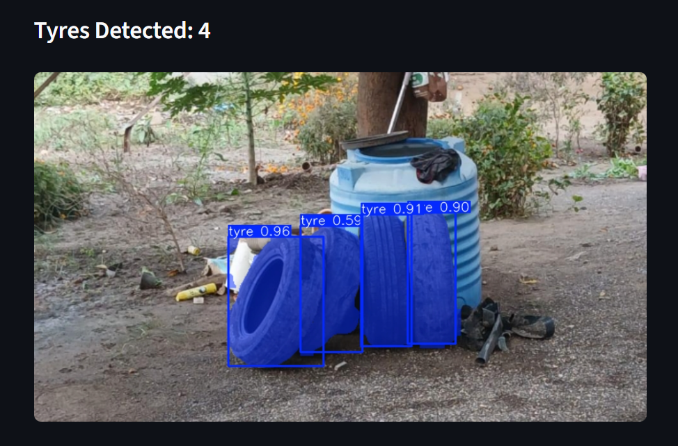

# Tyre Segmentation and Counting

This project detects, segments, and counts tyres in images using a YOLOv8 segmentation model with a simple Streamlit interface.

## Features
- Tyre instance segmentation using YOLOv8
- Automatic tyre counting from segmentation masks
- Streamlit-based image upload and visualization

## Setup
1. run ``` python -m venv venv ```
2. run ``` venv\Scripts\activate ```
3. run ``` pip install -r requirements.txt ```
4. run ``` streamlit run app.py ```

## Example

**Input Image**


**Output Image**

